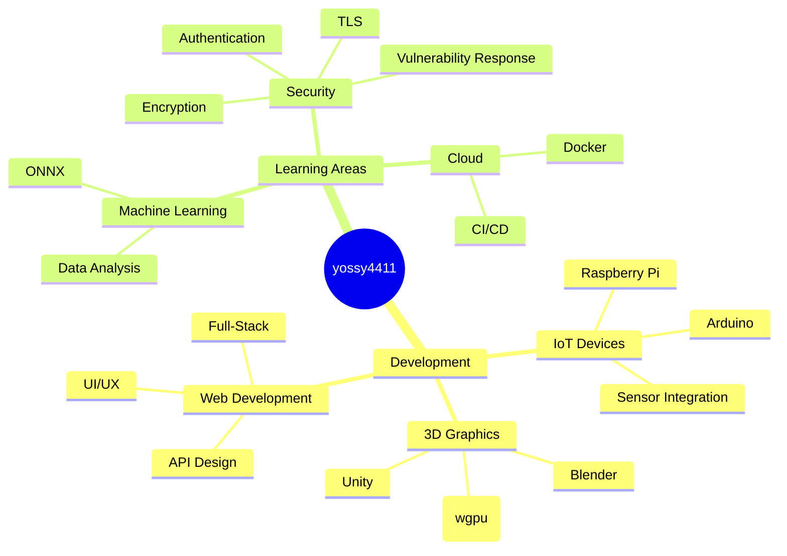

### Hello! I'm **yossy4411**

[日本語](./README.md) | **English**

🎯 **Middle School Programmer** | 🚀 **Full-Stack Engineer** | 💡 **Pursuing Creation and Innovation**

---

*"Changing the world through code" - that's my mission*

---

## About Me

My programming journey began in elementary school. What started as simple "fun" with Scratch has now evolved into a passion for **contributing to society through code** on GitHub.

I'm particularly interested in **disaster prevention**, dedicating my efforts to developing original seismographs and building information systems inspired by Web3 concepts.

## Okayu Group

**June 2024** - Founded [Okayu Group](https://github.com/okayugroup)  
Currently 2 members learning and growing together!

## Technical Skills

### Programming Languages

### Frameworks & Tools

### Development Environment

| Field | Tech Stack |
|-------|------------|
| **Frontend** | Avalonia, Next.js, iced(Rust) |
| **Backend** | Go, .NET Core, PHP |
| **Database** | SQLite, PostgreSQL |
| **OS & Environment** | Linux, Windows, Docker |

## Featured Projects

### Currently Developing
<table>
<tr>
<td width="100%">

#### [OGSP - Disaster Prevention Project](https://ogsp.okayugroup.com/) - Building a community-driven disaster prevention network.

- **Goal**: Community-driven disaster information sharing system
- **Technology**: Web technologies, Rust GUI, Go server, embedded seismograph
- **Impact**: Improving community safety
- **Progress**: Actively developing with serious consideration

</td>
</tr>
</table>

### Past Achievements
- **EarthQuake** - Developed earthquake monitoring app with Avalonia. Struggled with memory usage and GC, currently rebuilding from scratch in Rust.

## Areas of Expertise & Interest

### Currently Learning
- **Cryptography**: Creating encryption for embedded software, usable over UDP
- **Cloud Technologies**: Docker, Kubernetes operations
- **WebAssembly**: High-performance web app development with Rust

### Future Goals
Earning 20 million yen annually to make my partner and family happy  
Turning ideals into reality

Saving as many people as possible from disaster damage

## GitHub Activity

### Coding Statistics

### Activity Graph

## Connect With Me

### Online Presence

### Articles & Blog

| Platform | Content | Link |
|----------|---------|------|
| **Qiita** | Technical articles & dev blog | Coming soon |
| **Okayu Group Blog** | Daily life & learning records | [okayugroup.com](https://okayugroup.com/blog) |
| **YouTube** | Home base | [@yossy4411](https://youtube.com/@yossy4411) |

---

### Life Motto

> Code to Protect. Create to Evolve.  
> <em>コードで守り、創造で拓く</em>

---

**Help Welcome!**: Feel free to open issues or PRs to support my activities!

