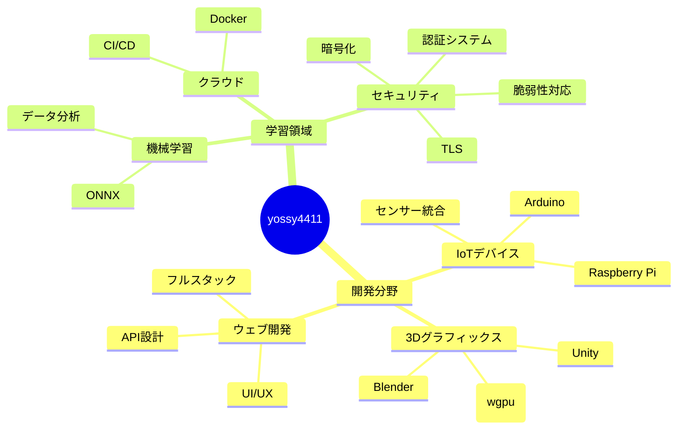

### こんにちは！私は **yossy4411** です

**日本語** | [English](./README-ENG.md)

🎯 **中学生プログラマー** | 🚀 **フルスタックエンジニア** | 💡 **創造と革新を追求**

---

*「コードで世界を変える」それが私の使命です*

---

## 私について

プログラミングとの出会いは小学校。単純な「面白さ」のScratchから、今ではGitHubで**コードを通じて社会に貢献する**ことが私の情熱となっています。

また、**防災**について興味があり、地震計の独自開発やWeb3から発想を得た情報システムの構築にも力を入れています。

## おかゆグループ

**2024年6月** - [おかゆグループ](https://github.com/okayugroup)を設立  
現在メンバー2人で、共に学び合いながら成長中！

## テクニカルスキル

### プログラミング言語

### フレームワーク & ツール

### 開発環境

| 分野 | 技術スタック |
|------|-------------|
| **フロントエンド** | Avalonia, Next.js, iced(Rust) |
| **バックエンド** | Go, .NET Core, PHP |
| **データベース** | SQLite, PostgreSQL |
| **OS・環境** | Linux, Windows, Docker |

## 注目プロジェクト

### 現在開発中
<table>
<tr>
<td width="100%">

#### [OGSP - 防災プロジェクト](https://ogsp.okayugroup.com/) - みんなでつくる、防災ネットワーク。

- **目標**: コミュニティ主導の防災情報共有システム
- **技術**: Web技術, RustでのGUI、Goでのサーバー、組み込みの地震計
- **影響**: 地域コミュニティの安全向上
- **進捗**: 真剣に検討を重ねながら開発中

</td>
</tr>
</table>

### 過去の成果
- **EarthQuake** - Avaloniaでの地震モニタリングアプリを開発。メモリ使用量とGCに悩まされ、現在はRustで1から作っている。
  
## 専門分野 & 興味領域

### 現在学習中
- **暗号化**: 組み込みソフトウェアのための、UDP上で使用できる暗号化の作成
- **クラウド技術**: Docker, Kubernetes の運用
- **WebAssembly**: Rustでの高速ウェブアプリ開発

### 将来の目標
年収2千万円でパートナー・家族を幸せにすること  
理想を現実にすること

災害の被害から1人でも多く救えるようにすること

## GitHub アクティビティ

### コーディング統計

### アクティビティグラフ

## Connect With Me

### オンラインプレゼンス

### 記事 & ブログ

| プラットフォーム | 内容 | リンク |
|-----------------|------|-------|
| **Qiita** | 技術記事・開発ブログ | 準備中 |
| **おかゆグループ ブログ** | 日常・学習記録 | [okayugroup.com](https://okayugroup.com/blog) |
| **YouTube** | おうち | [@yossy4411](https://youtube.com/@yossy4411) |

---

### 座右の銘

> コードで守り、創造で拓く  
> <em>Code to Protect. Create to Evolve.</em>

---

**お手伝い大歓迎！**: 自由にIssueやPRを立てて、私の活動を後押ししてください！

